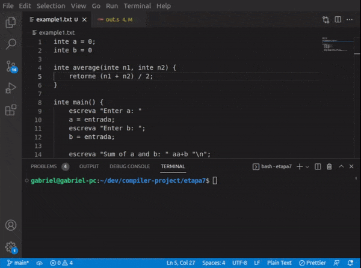

# compiler-project

The goal of this project was to build a compiler from scratch for a language specified by the professor. It was separated into 7 incremental parts:
- 1: create the lexical analyzer using lex tool and initialize a global symbol table;
- 2: create the syntax analyzer using yacc and populate the global symbol table;
- 3: store the derivation tree found by the parser from part 2 (generated by yacc) in an Abstract Syntax Tree (AST) structure;
- 4: perform semantic verification through a series of tests;
- 5: intermediate code generation from AST; creation of the Three-address code (TAC) structure; temporary symbols and labels;
- 6: translation of the intermediate code (TAC) generated in the previous part to assembly code;
- 7: compiler error recovery and optimization.

This project was developed for the Compilers course at [INF](https://inf.ufrgs.br)-[UFRGS](https://ufrgs.br).

### Code compilation example 1

### Code compilation example 2
